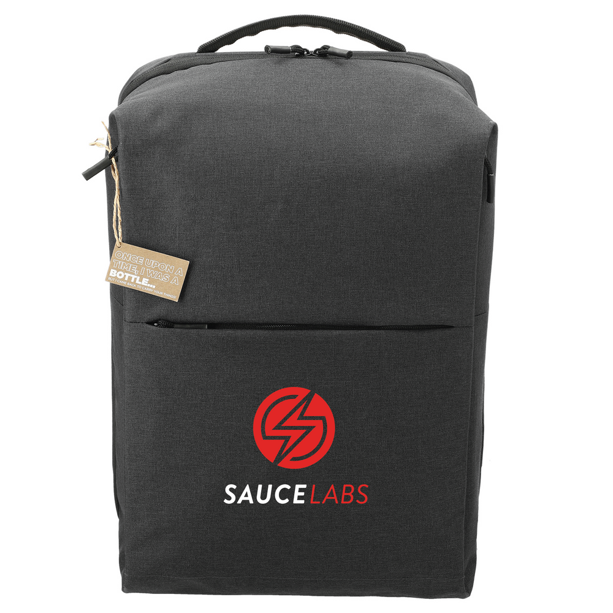

<div id="header" align="center">

<div id="badges">
<!-- badges: start -->

<!-- [](https://github.com/c3ccl3ston/automation-best-practices-java/actions/workflows/e2e_test_examples.yaml)
[](https://github.com/c3ccl3ston/automation-best-practices-java/actions/workflows/e2e_test_solutions.yaml) -->

<!-- badges: end -->
</div>
</div>

## You will learn to:

In this automation best practices workshop you will learn the latest and greatest tools and techniques to drastically 
improve your testing!

We will focus on a holistic approach of risk mitigation by doing:

- Functional web testing
  - Create a framework for doing comprehensive web testing
  - Use industry-standard best practices
  - Create functional browser tests using Selenium
- Many other things in between
  - Accessibility testing
  - Run in massive parallel (100s of tests in < 5 min)
  - Automatically get robust test reports which includes logs + videos

## Technologies you will use:

<div>

[![Java](https://img.shields.io/badge/Java-3A75B0?style=for-the-badge&logoColor=white&logo=data%3Aimage%2Fpng%3Bbase64%2CiVBORw0KGgoAAAANSUhEUgAAACYAAAAwCAYAAAB9sggoAAAAAXNSR0IArs4c6QAAAIRlWElmTU0AKgAAAAgABQESAAMAAAABAAEAAAEaAAUAAAABAAAASgEbAAUAAAABAAAAUgEoAAMAAAABAAIAAIdpAAQAAAABAAAAWgAAAAAAAABIAAAAAQAAAEgAAAABAAOgAQADAAAAAQABAACgAgAEAAAAAQAAACagAwAEAAAAAQAAADAAAAAAmGgvegAAAAlwSFlzAAALEwAACxMBAJqcGAAAAVlpVFh0WE1MOmNvbS5hZG9iZS54bXAAAAAAADx4OnhtcG1ldGEgeG1sbnM6eD0iYWRvYmU6bnM6bWV0YS8iIHg6eG1wdGs9IlhNUCBDb3JlIDYuMC4wIj4KICAgPHJkZjpSREYgeG1sbnM6cmRmPSJodHRwOi8vd3d3LnczLm9yZy8xOTk5LzAyLzIyLXJkZi1zeW50YXgtbnMjIj4KICAgICAgPHJkZjpEZXNjcmlwdGlvbiByZGY6YWJvdXQ9IiIKICAgICAgICAgICAgeG1sbnM6dGlmZj0iaHR0cDovL25zLmFkb2JlLmNvbS90aWZmLzEuMC8iPgogICAgICAgICA8dGlmZjpPcmllbnRhdGlvbj4xPC90aWZmOk9yaWVudGF0aW9uPgogICAgICA8L3JkZjpEZXNjcmlwdGlvbj4KICAgPC9yZGY6UkRGPgo8L3g6eG1wbWV0YT4KGV7hBwAAB9pJREFUWAnFmGmoVVUUgN9znrJybnJqsLQ0zEa1EhItLcTIwtLCH4JKJQ0%2F6kfSYFHQAIFDFpRFBQWVDYQJmdE8qJkZlqamZs5Tzvr6vn33Pp373sXee95owffW3mtP66y9zt7nvoqKMkpVVVUDp0O3gC7QMNaDvS5L1XlAbSavrKzcQ7%2BhcFbsX%2Bd1GtVmobr0IUr4VVnFmCvA%2BZfBkZyd6r9LWRzLLdrMaFFvydJDYKsuYNMxt%2FWw9dpInUNcfdLkFLoJbQdi%2B2R0G%2Fgr1v8fpVPRMRP%2FJjgAyvjkEeXKUuVkK7tmwWZpUbRO7QJlM5zvguim0BhaQouyO1F9wvwilCdDXqZFp4xmsxJjjzmNqs9pBCohe3LKM0A5WFBVq9A98gOpG7EB8AAMh7C1Sef71qvMRA2gqYPRp8ICUPYVVPjrGWa7zoyE6bAB9sOj0NH2sgkT6lQ4YtCXwlpQdhdU%2BDvKBSmNgu9AZxT7Di6bM2kiJtWpkBfooZAW3Ek5yejo1LRkiPpVdH7ry5NfTGpOJacGUk65tINykrHRqVnJEPVDuYdrhC3cn8l2TJrJ0va1o7wsLrgtatXt0akxOZvFqWlhyo1TuSyaCbOwU54ISj6nHo5OGdWPQmvhz8eo4Aw6vCx1cShb9CiDshObPn1jv4NRv4ueEsseD6fHsupL7sjU71DOXqtibRzLT5TuvtYYj8AML%2Bhch%2Ba58nlEKuVTXdepqM2A8MkSF%2Fwsasf9Ab%2FEumotrIl1IzUMBsW6n0HlF548JX9ryl%2BC4hs5wtXQRlB9Nyh%2B%2BihzIeVZeZM%2FLpg%2FLjzDksyO7Wlx78X5sTHdBDfEPp6D%2BXzVfOzCpNm2U74nLr4VHV4IdFtXQfeD%2FFHyclode4h8qtdbM1GIFDo8LTrbDspPgjLDBdD2SXfoVBuifIhOEc2Pz8%2F979FkkjSgZNhpz0duZly8f3SuXdR%2BRWyMbU9oU6int7RgqPaX9pJrOrB0Q2HS5rS3AV%2BA7PuK8mPwDjSE4DR6MCh%2ByZ7j%2BuhmUGN%2BbFkUY7%2FQJ%2BvoICS81pRPoFNv6AX%2BBOsK%2B%2BF7WBA1quKgY5DhlA9QnquR%2Bvuoq%2BFKbPYvEtqPx%2BBXyBg4CdbALPq%2Bjq4pDPCp74AVkBe%2FDk6tOaKmhX5XwVPgw2VCvRX00Q5%2Bx10P5mL%2BQ2CCA7A1CBGjgLPhya%2FFPifO5i8eT%2FXd8Ax8BX66ePrvBX%2BKGWG3z6312tGZTvBn1EZc22mR%2BegHWWsdOghrd6PwMXSBTWranT94mBw8m46LwNO%2B3PJoWKywnp8%2FIWfj%2Bm%2FGxQ6jz9EWzpUYrQbon2m4DPstcAnYqSWYX0ZCjKJRMlpGSWw3kkZ3J2yA32ElrAYvdG1uU2PKXlmHKDtWObGgwtzuVEWIVDQ6qBGDUudgxuYRMBbcxrfBg9TzSgddYB%2FolA7tYPwOdA1hHq%2BtPWl%2B6s0p70Wfif1rcMt%2FhR7YnbtY6Oi1YpR0tD14VvnF%2Blpxz6PX6N8JroFwM8T5Usr4IyUcE%2BgXIcmk2K%2BQ%2FPkl6IHD2bHxAm3jYrsh9rj4HPyS2AZGy6czJYyox0AHMNm7g06ZyNNhGvOuYf60lT74BO2gvEL7GAv6oC6SvJHydZA%2BpSnWWzYx8sb8QtTvjbN52U9NbZTN3%2BIcS415TUcTfgScAl3hYugM4V5E52UPlc2wGhbCb7A8lrcSEX9ZmSZ3gjsxD57D7k4YqSzHi0JmA%2B1F95mTxUG90D71e7AUfGNTf18C30i3NzlwHGN3US8S1vCh%2BsE3tPvmpq3TKef5R%2BjsPVYqAuEpaLsZtoPyCHh6N08zUDaZ%2FQV1LoyAKfA5%2BONkQK5f2KZUV9Puv0XNzyLxuG%2BCp%2BHssIV6K5SR1L4l2jahPTb2gg5p3wg%2BYeiLdpzJr64uj2O4n%2FnCMcAaKdKHsYXjCVtDyoeLBmLsAY%2FDPPCe9Nf1ctB2CtwF6Zc3xVrLSnr65TESQrRKaD8sLypyiIoRM7FfAg%2FAJM9TmAtGZSlPspl%2BvSkPAnPNF8GD1i0wJ1OOGcn1sAJ%2Bgh8ZuwYdhDmMrniGtaJtC7bbKE%2BHi6gvsQ9S5datB8V7SplJp0yo18i%2FaDPPPIA7Qls4DtyiIsHmw4c8QnvZZ0K9C3wKyujUQLmJjn2hFTG5vb82gJ8%2BHhP%2FiTC3Hwv3we%2BgLAXzM7wMap%2FGU9o7MLs6bEDcjkWwGNyWVeBL4F3onVf8amPMC%2FO6XS2hDbj1Z4Dp4Dko6Q2dQ3ki861jjP%2F19sDt6X7rZRPUrTAOLoFS4hu5HXRsJ6TvsuyNxma%2BuV06ZAR0yrc53IvoJObiezAbPsGZ7G3El0nYRhkx7NndqKO9wCe6EPpADzgR6is%2BiC%2FAMlgI38IPrOmLlQl%2B9KXyNFwOQ1PE%2FBYLZ0zWM1dg0AlU3Q633dzTUd9ID2UT3m31hjCqnvbbwKhshk2WmT%2BcV5QzYV7f7GEwHvqD33jD6ftBcIyK22lZDCHVcNB67bQHt2019lXoegtzdmBwT9CJITAQkjxL4SHW8GiqzBxLrerQUHDOnDFKF4D3mwnseWeEzDejshXMuX2Qom5OGWUf6mToAt3AfEtihBfAG%2FCWDtnA2mH3Sjpmh1LCIF%2BS7uBTm4vmX2cwEm6v15XJr2Nui1u7B1zUC3s5LIHF8BPO%2BEBBdIhC2C0NfwNcBnrvYuSigAAAAABJRU5ErkJggg%3D%3D)](https://www.java.com/en/)
</div>

<div>

[](https://www.selenium.dev/)
</div>

<div>

[](https://maven.apache.org/index.html)
</div>

<div>

[](https://www.saucelabs.com)
</div>

<div>

[](https://github.com/features/actions)
</div>

## Table Of Contents

- Introduction to workshop
- Setup
  - [Gitpod setup](#gitpod-setup)
  - [Local setup](#local-environment-setup)
  - [Setting data center](#setting-data-center)
- [E2E browser tests](./docs/E2E-TESTS.MD)
- [Atomic tests](./docs/ATOMIC-TESTS.MD)
- [Accessibility tests](./docs/ACCESSIBILITY-TESTS.MD)
- [Parallelization](./docs/PARALLEL.MD)
- [Conclusions](./docs/CONCLUSIONS.MD)

## Requirements

- Java programming experience
- Understanding of Selenium WebDriver
- Understanding of OOP
- Java 8 installed
- Java IDE installed
- [Git installed](https://git-scm.com/downloads)
- [Github account](https://github.com/s)
- [Maven installed](https://maven.apache.org/install.html)
- Sauce Labs account. If you need one, [get it free](https://www.saucelabs.com/sign-up)

## Your Instructor: Nikolay Advolodkin


- 🔭 I’m the founder of [Ultimate QA](https://ultimateqa.com/)
- 🏢 I’m a Sr Solutions Architect at Sauce Labs
- 🌱 I’m currently working on [Sauce Bindings](https://github.com/saucelabs/sauce_bindings)
- 💬 Ask me about environmentalism, veganism, test automation, and fitness
- 😄 Pronouns: he/him
- ⚡ Fun fact: I'm a Ukranian-Jew that was born in Uzbekistan, speaks Russian, and was raised in US
- 📫 Follow me for testing and dev training
  - [Java Testing Tips Weekly](https://ultimateqa.ck.page/selenium-java-tips)
  - [Testing Training on Youtube](https://www.youtube.com/ultimateqa?sub_confirmation=1)
  - [LinkedIn](https://www.linkedin.com/in/nikolayadvolodkin/)
  - [Twitter to know about all my events](https://twitter.com/intent/follow?screen_name=nikolay_a00)

## Setup

### Sign up for account

[](https://saucelabs.com/sign-up)

### Get your username and api key

- Save your Sauce Labs Username and Access Key by going to the [Sauce Labs user settings page](https://app.saucelabs.com/user-settings)

### Gitpod setup

[](https://gitpod.io#https://github.com/nadvolod/selenium-automation-advanced)

> ℹ️ Gitpod lets you run an entire Dev environment from a browser! You can use this approach if you don't 
> know how to set up a local Java environment.

1. Once the Gitpod.io URL is loaded, you will need to sign in with the GitHub account you created earlier
2. Once the development environment is loaded, you should see 'Ready to test!' in the Terminal window in the lower 
portion of the window, run the following commands in that Terminal to set your `SAUCE_USERNAME` and `SAUCE_ACCESS_KEY`:

> ℹ️ You can get your Sauce Labs Username and Access Key by going to the [Sauce Labs user settings page](https://app.saucelabs.com/user-settings)

```bash
eval $(gp env -e SAUCE_USERNAME=<sauce_username>)
eval $(gp env -e SAUCE_ACCESS_KEY=<sauce_access_key>)
```

> Replace <sauce_username> and <sauce_access_key> with your credentials

Once you have run those 2 commands, you can run the following commands to test your environment variables:

```bash
echo $SAUCE_USERNAME
echo $SAUCE_ACCESS_KEY
```

Run sanity tests

```bash
mvn test -Dtest="E2ESolutionTests#appRenders" -X
```

  <details>
    <summary>
      <strong>Click here</strong> to see an example console output.
    </summary>

        Results :

        Tests run: 1, Failures: 0, Errors: 0, Skipped: 0

        [INFO] ------------------------------------------
        [INFO] BUILD SUCCESS
        [INFO] ------------------------------------------
        [INFO] Total time:  12.410 s
        [INFO] Finished at: 2022-07-11T10:06:10-04:00
        [INFO] ------------------------------------------

  </details>

### ✅ 👏 Environment setup is complete if tests passed

---

### Local environment setup

ℹ️ Only recommended for those that know how to correctly setup a Java + Maven environment

Fork then clone the repo

1. Sign up for a free [GitHub account](https://github.com/)
2. [Fork this repository](https://docs.github.com/en/get-started/quickstart/fork-a-repo)

   - Make sure you are logged into GitHub
   - Click the Fork in the upper right of the GitHub.

3. Clone your fork of the repository to your machine. Must have [Git installed](https://git-scm.com/downloads)

```bash
git clone URL_OF_YOUR_FORK
```

Setup environment variables on your system

[](https://docs.saucelabs.com/basics/environment-variables/#setting-up-environment-variables-on-macos-and-linux-systems)
</br>
[](https://docs.saucelabs.com/basics/environment-variables/#setting-up-environment-variables-on-windows-systems)

Navigate to the directory of where you cloned your repo

```bash
cd YOUR_FORK_DIR/automation-best-practices/workshop
```

Run sanity tests

```java
mvn test -Dtest=E2ETests -X
```

  <details>
    <summary>
      <strong>Click here</strong> to see an example console output.
    </summary>

      Results :

      Tests run: 4, Failures: 0, Errors: 0, Skipped: 3

      [INFO] ------------------------------------------
      [INFO] BUILD SUCCESS
      [INFO] ------------------------------------------
      [INFO] Total time:  12.410 s
      [INFO] Finished at: 2022-07-11T10:06:10-04:00
      [INFO] ------------------------------------------

  </details>

### ✅ 👏 Environment setup is complete if tests passed

## Setting data center

By default, the data center selected for our exercises is `US_WEST`. If you would like to switch to another data 
center (i.e. `EU_CENTRAL`), please update the [E2ETests](workshop/src/test/java/com/saucedemo/exercises/E2ETests.java) with the appropriate data center.

## Stay to the end and win a prize!

Stay to the end and 2 lucky people can win a snazzy Backpack!



## Key

💡 this is a tip

🏋️‍ this is an exercise for you to do

❓ this is a question for us to think and talk about. Try not to scroll beyond this question before we discuss
