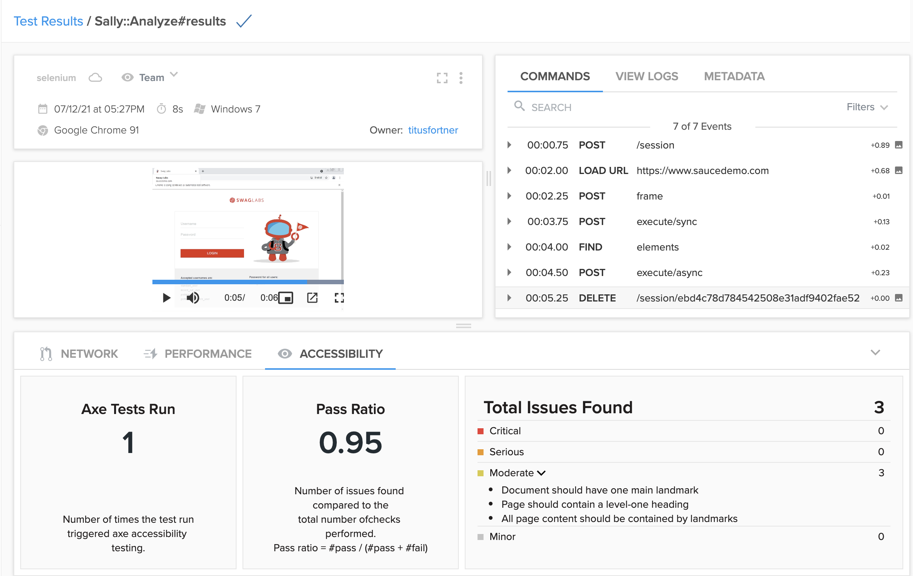

# Accessibility Tests

## Deque axe™ Integration

[Deque's axe™](https://www.deque.com/axe/) is one of the world's leading digital accessibility toolkits. 
The ```axe-core``` library provided by Deque allows you to inject functionality into your tests in order to scan 
content and return an ```a11y``` score.

Below is a guide to set up the Sauce Labs integration. This integration allows you to run your accessibility 
tests on our platform with axe™.

> ℹ️ **WHY SHOULD YOU CARE ABOUT ACCESSIBILITY TESTING?**
> <br>
> Check out the [Deque Accessibility Guide](https://www.deque.com/web-accessibility-beginners-guide/#what-is-a11y) 
> for further information.

## What You'll Need
- Sauce Labs account ([Log in](https://accounts.saucelabs.com/am/XUI/#login/) or sign up for a 
[free trial license](https://saucelabs.com/sign-up))
- [A Deque Account](https://axe.deque.com/plans) (Optional)

## Sauce Labs UI
Sauce Labs will display the accessibility results in our UI as a tab in the job itself:



## Sauce Bindings – Accessibility

As of version 1.2, Sauce Bindings supports the new Sauce Labs Deque axe™ Integration

- The Session classes now have a method to obtain accessibility results, which does two basic things:
  - Populates the new Accessibility tab in the Sauce Labs UI for a given job with the accessibility violations found 
  during the test run.
  - Returns the specific violations found in the code. The format of these results varies by language, and it is left 
  to the user to determine how best to make use of them in their code if so desired.
- The Java code is implemented using Deque's Axe Core Maven HTML Jar
  - This implementation provides access to all the advanced features.
  - As a wrapper, Sauce bindings provides 3 method signatures for getting accessibility results, as outlined below.

---

### ️👀 How does this work?

Let's walk through the code

---

### ❓Questions or concerns about this process

---

[🧪 Let's review test coverage](TEST-STRATEGY.MD)
